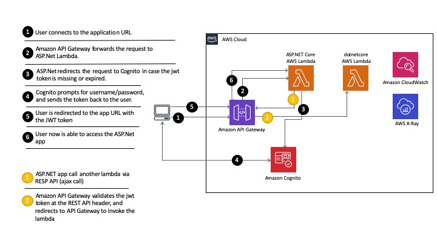

## Build and monitor a secure Serverless app powered by AspNetCore WebApp with Amazon Cognito and x-Ray

In this workshop you'll deploy a serverless web application based on AspNetCore that leverages the Amazon Cognito Hosted UI for sign-up and sign-in. During the sign-in process, the AspNetCore application receives the JWT token from Amazon Cognito, processed by the standard DotNetCore OpenIdConnect library. The AspNetCore will interface with a serverless dotnet backend via a RESTful web service call. The backened RESTful API is exposed via Amazon API Gateway, which is integrated with the same Amazon Cognito that issued the JWT token for the AspNetCore, hence providing authentication enforcement/seamless integration.

See the diagram below for a depiction of the complete architecture.



## Initial environment setup

### Prerequisites

#### Laptop Machine

**Before you start reading all the Pre-requisites, there is an option to execute a [Cloudformation script](cfn-templates/webdevbox.yml), which installs all the software required into an EC2 Windows Server for following the workshop.** This is a perfect option if you don't have much time or just lazy to install all the software required. The cloudformation could be executed multiple time in one AWS Account, but this approach is not the ideal for running the workshop as the attendees can accidentally change someone's resources.

A laptop with Wi-Fi running Microsoft Windows and Mac OS X with the following softwares installed:
- An Internet browser such as Chrome, Firefox, Safari, or Edge.
- The AWSCLI for [Windows](https://docs.aws.amazon.com/cli/latest/userguide/install-windows.html) or [Mac](https://docs.aws.amazon.com/cli/latest/userguide/install-macos.html)
- The Long Term Support (LTS) [.NET Core](https://dotnet.microsoft.com/platform/support/policy/dotnet-core) version supported by [AWS Lambda for .NET Core](https://github.com/aws/aws-lambda-dotnet) installed. Links for downloading the supported version for [Windows](https://download.visualstudio.microsoft.com/download/pr/29f92590-ac92-45f0-99e8-e60c767dc4e9/ddc1014a788613364b5308d6c49db3db/dotnet-sdk-2.1.801-win-x64.exe) or [Mac](https://download.visualstudio.microsoft.com/download/pr/3998e58a-46dd-4f9c-a0e2-d17309de20fb/d694ddf3d8f99e8dee928e0b46f15084/dotnet-sdk-2.1.802-osx-x64.pkg)
  - It is possible to execute non-LTS .NET Core on AWS, as per this [blog](https://aws.amazon.com/blogs/developer/announcing-amazon-lambda-runtimesupport/). For simplicity, this workshop is based on the LTS .NET Core version.
- AWS extensions for the dotnet CLI.
  - After have installed dotnet in your machine execute the following program:
  ```
    dotnet tool install -g Amazon.Lambda.Tools
  ```
- [Docker for Windows](https://docs.docker.com/docker-for-windows/install/) or [Docker Desktop for Mac](https://docs.docker.com/docker-for-mac/install/)
- AWS SAM CLI
  - [Windows](https://github.com/awslabs/aws-sam-cli/releases/latest/download/AWS_SAM_CLI_64_PY3.msi)
  - For Mac instalation it is recommended doing it via [brew](https://brew.sh/). By following the commands:
  ```
    brew tap aws/tap
    brew install aws-sam-cli
  ```
- You favorite IDE for .DotNet (VisualStudio or VSCode is recommended)

#### AWS Account
- Ability to create AWS resources including EC2, SSM, Lambda, Api Gateway, Cognito and IAM Roles.
- EC2 key pair created in the AWS region you are working in in case you use the EC2 instance instead your own computer

> **Important Note:** This guide creates chargeable AWS resources. You may wish to remove these resources upon completion of the guide to avoid incurring future charges to your account. To do this, be sure to follow the instructions in *Clean up* module.

## Modules

Follow the modules in order to successfully configure and deploy the sample application to AWS.

| Labs |
| ------------- |
| [0 - Setup AWS Tools and credentials](lab-0-tools-and-cred/) |
| [1 - Creating the AspNetCore](lab-1-aspnetcore/) |
| [2 - Creating the backend serverless dotnet](lab-2-backend/) |
| [3 - Testing Lambda using SAM Local](lab-3-samlocal/) |
| [4 - Creating and configuring Amazon Cognito UserPools](lab-4-cognitouserpools/) |
| [5 - Creating and configuring Amazon Api Gateway](lab-5-apigateway/) |
| [6 - Adding OpenId to AspNetCore and inject jwt to backend](lab-6-jwttoken/) |
| [7 - Adding Monitoring and x-Ray](lab-7-monitoring/) |
| [99- Clean up](lab-99-clean-up/) |