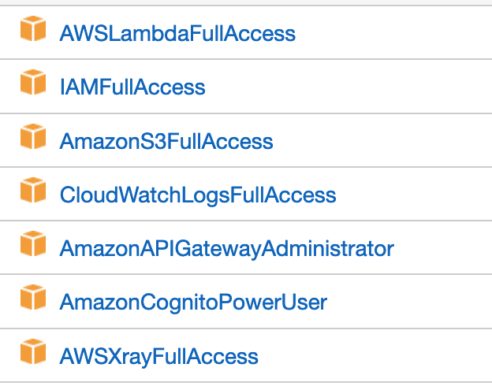
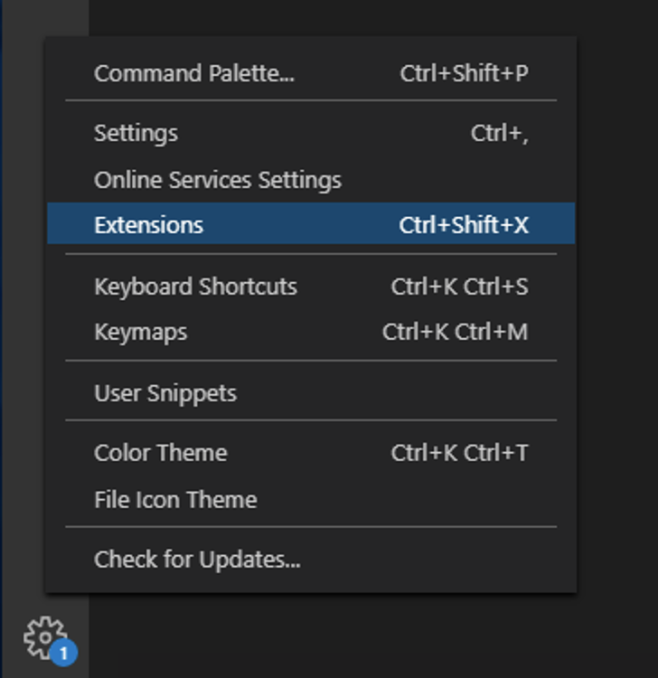
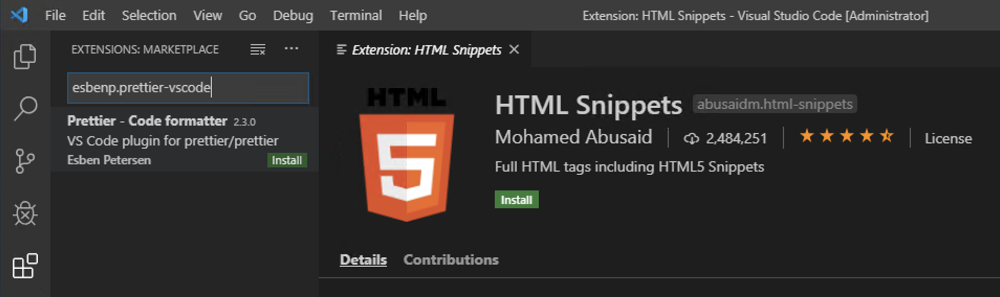
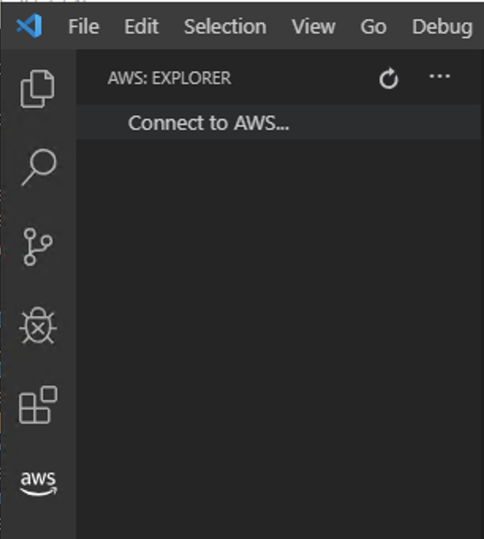

# Lab 0: Setup the AWS tools and user credentials

The steps in this module will walk you through setting up the [Visual Code](https://code.visualstudio.com/) with the AWS extensions. Finally you will create an [Identity and Access Management (IAM)](https://aws.amazon.com/iam/) user in your account with programmatic credentials, and configure a local credential profile containing the AWS access and secret keys generated for the user that will then be used by the AWS tools.

> ***Note: You may skip this module and proceed directly to Lab 1 if you already have the tools installed and have a credential profile for an IAM user (with at least AWS Power User permissions) on your machine, .***

## Step 1: Create an IAM user with programmatic credentials and console sign-in

AWS strongly recommends creating an Identity and Access Management (IAM) user for use with the AWS development tools and to *not* use your root account credentials. Follow the steps below to provision a new user, and generate programmatic credentials (access and secret key) and console login link with password, for use with the tools.

1. Log into the AWS Management Console.
2. At the Console Home page, enter the text *IAM* in the **Find Services** field.
3. Click the resulting selection to jump to the IAM console home.
4. Select **Users** in the left-hand panel.
5. Click *Add User*.
6. Give the new user a name and check both *Programmatic access* and *AWS Management Console access* for **Access type**. You can specify a console login password of your own choice if you wish, or have a password generated for you, and can also elect to require a password reset on initial login if you so choose.
7. Click *Next: Permissions*.
8. Click *Attach existing policies directly*.
9. In the **Search** field enter the text *lambda*.
10. Check *AWSLambdaFullAccess* in the resulting list.
11. Repeat Step 9 and 10 for the following :
    1.  Search: *apig* Check: *AmazonAPIGatewayAdministrator*
    2.  Search: *cog*  Check: *AmazonCognitoPowerUser*
    3.  Search: *log*  Check: *CloudWatchLogsFullAccess*
    4.  Search: *xray*  Check: *AWSXrayFullAccess*
    5.  Search: *iam*  Check: *IAMFullAccess*
    6.  Search: *s3*  Check: *AmazonS3FullAccess*
    7.  Search: *cloud*  Check: *AWSCloudFormationFullAccess*

    > **Note:** This specific user we are creating is for your local development purposes only. You can also use an existent IAM user as long as the IAM user has enough permissions.

1.  Click *Next: Tags*.
2.  You may add tags to the new user if you wish, they are not required for this guide.
3.  Click *Next: Review*.
4.  Review the selections to ensure the **Managed policy** has the following managed policies were associated:
    
5.  Click *Create user*.
6.  **Important**. On the next screen click the **Download .csv** button to download a csv-formatted file containing the user's generated credentials to your machine. You will use these to create a credential profile for the user for use with the tools. You can also find the url to the console login for your new user displayed on this page. We recommend you sign into the console at this time. The password for the user is contained in the csv file you just downloaded.

    > Note: this is the ***only*** time you will be able to obtain the secret access key for this user so do not skip downloading the file!
7.  Once you have downloaded the csv file, or made a note of the generated credentials (access *and* secret key) click *Close* to return to the *Users* home page in the IAM console.

You have now created a new user in your account for use with the tools and can proceed to the next step to configure the tools to use this user's credentials.

## Step 2: Setting up a credential profile

Follow these steps to create a credential profile aws cli.

1. Start your terminal (Mac) or a PowerShell command prompt.
   > Note: If you receive a command not found error when running aws cmd, please check whether enviroment PATH has the aws cmd PATH in it.
2. Enter the command as shown below, pasting in the access and secret access key values from the csv file you downloaded in the previous step.

    ```
    aws configure --profile <your profile-name>
    ```

    > Note: If you dont provide a profile name, the profile is automatically assigned to be the default profile.

3. Respond to the prompts, supplying the access key and secret access key values from the csv file you downloaded previously. You can accept the default profile name or change it. When prompted to select a default region,vscodeaws1.png enter the region you will be deploying this sample to (for convenience).

## Step 4: Creating a S3 bucket for deployment

To create an S3 bucket

1. Sign in to the AWS Management Console and open the Amazon S3 console at https://console.aws.amazon.com/s3/.
2. In the Bucket name field, type a unique DNS-compliant name for your new bucket.


    > Note: The name must be unique across all existing bucket names in Amazon S3. For this workshop use something like *your first initial + last initial + workshop-dotnetcore-date*. For John Smith - js-workshop-dotnetcore-12022019

For information about naming buckets, see [Rules for Bucket Naming](https://docs.aws.amazon.com/AmazonS3/latest/dev//BucketRestrictions.html#bucketnamingrules) in the Amazon Simple Storage Service Developer Guide.


3. Choose Create bucket.

## Step 3: Adding extentions to Visual Code

In this step you will install the AWS extension for Visual Code, along with other useful extension. Visual Code is compatible with Windows, Mac and Linux. If you do not wish to use Visual Code, you can skip this step.

1. Install Visual code
2. Start Visual Studio and, at the lower-left corner click on the *Manage* icon, then *Extensions*.
   
3. In the Search Extensions field type the following packages names and click on *install*.
    ```
    ms-vscode.csharp
    amazonwebservices.aws-toolkit-vscode
    mohsen1.prettify-json
    esbenp.prettier-vscode
    ```
   
4. Click on the *Manage* icon again and check for Updates or install a pending Update. Restart VSCode if needed.

## Step 4: Setting AWS extension at VSCode

1. Open Visual Studio. You should see an AWS Icon at the left bar. Click on the Icon and select *Connect to AWS*
   
    > Note: if you already have configured the AWS Extention before you will need to click on the three dots at the top left in the image below to access the *Connect to AWS* option.

2. Select the profile configure on the Step 2.
3. Select the region you want to connect
4. You are now have connected VSCode with you AWS account.

***You have now completed this module and can move onto [Lab 1](../lab-1-aspnetcore/).***
