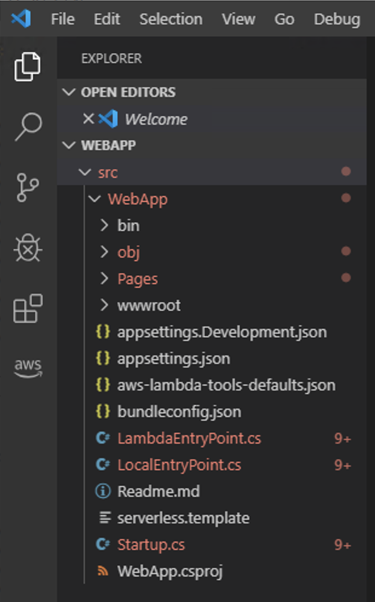
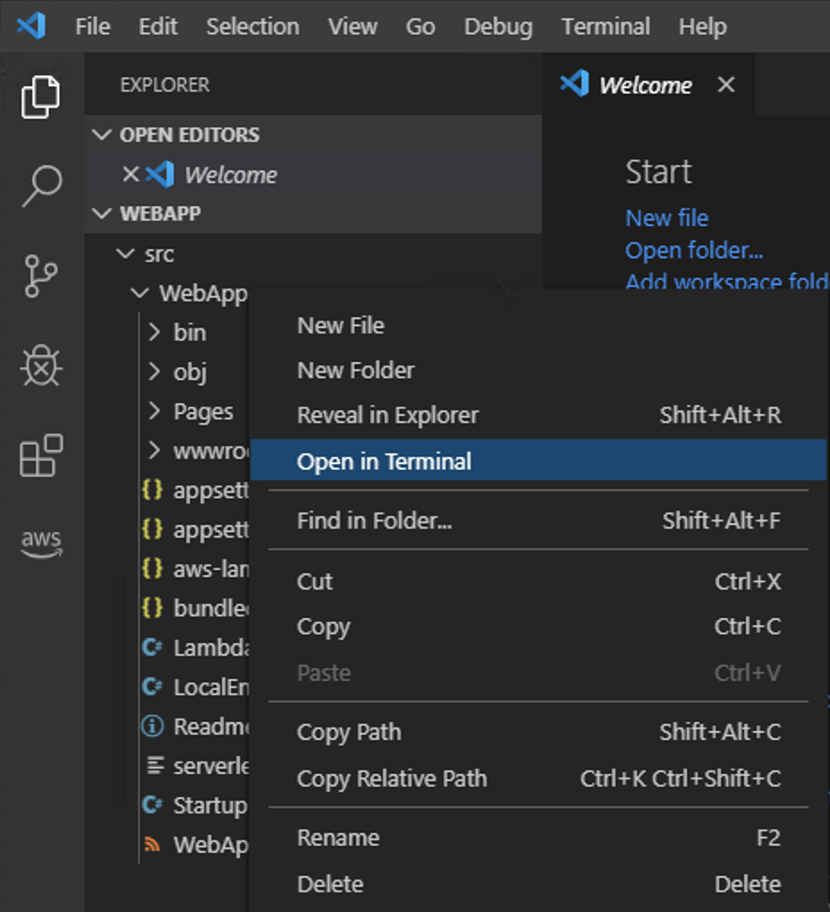
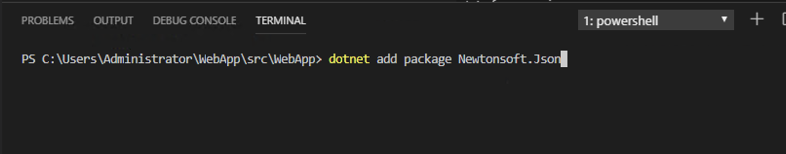

# Lab 1: Creating the AspNetCore applicatoin

The steps in this lab will create a new AWS lambda AspNetCore to act as your main website. We will also install all the required nuget packages and add/change the code for the workshop.


## Step 1: using dotnet cli to create a new project


1. Open a shell command or a Powershell command prompt.
2. Install the AWS extensions for the dotnet CLI.
    ```
    dotnet tool install -g Amazon.Lambda.Tools
    ```
3. Install the Amazon.Lambda.Templates  blueprints by executing the following command :
   ```
   dotnet new -i "Amazon.Lambda.Templates::*"
   ```
4. To see a list of the Lambda templates execute *dotnet new lambda --list*
5. Create the **WebApp** project executing the following command. *The project name has to be named WebApp as the workshop modules depend on this name* :
   ```
   dotnet new serverless.AspNetCoreWebApp --name WebApp
   ```
   
6. You now have a directory called WebApp with a C# project template for AspNetCore application.

### Opening your project at Visual Code

1. Open VSCode. Go to File -> *Open Folder* and select the WebApp folder created on the previous step. It will load all the sub-directories and files for you.

   

2. Right-click on the second *WebApp* directory that is located below of *src* directory and select **Open in Terminal**.
   <br>
   > We will run all the commands using this terminal window. You have to press ENTER to activate it. 

### Creating the Lambda Role

1. First, let's create a IAM role for granting access for your lambda functions access the resources needed for their executions.
2. Create a local filename called *LambdaRolePolicy.json* with the following content:
   ```
   {
     "Version": "2012-10-17",
     "Statement": [
      {
        "Effect": "Allow",
        "Principal": {
          "Service": "lambda.amazonaws.com"
        },
        "Action": "sts:AssumeRole"
      }
     ]
   }
   ```
3. From a PowerShell command prompt, at the same directory you have created the file above, execute the following:
    ```
    aws iam create-role --role-name LambdaDotNetWorkshopRole --assume-role-policy-document file://LambdaRolePolicy.json
    ``` 
4. It is now time to attach the IAM policies to our role. To do so, execute the commands:
    ```
    aws iam attach-role-policy --policy-arn arn:aws:iam::aws:policy/service-role/AWSLambdaBasicExecutionRole --role-name LambdaDotNetWorkshopRole
    aws iam attach-role-policy --policy-arn arn:aws:iam::aws:policy/AWSXrayWriteOnlyAccess --role-name LambdaDotNetWorkshopRole
    ```
5. Validade if the policies are successfully attached to the Role, executing:
    ```
    aws iam list-attached-role-policies --role-name LambdaDotNetWorkshopRole
    ```

    The response should be:
    ```
    {
    "AttachedPolicies": [
        {
            "PolicyName": "AWSXrayWriteOnlyAccess",
            "PolicyArn": "arn:aws:iam::aws:policy/AWSXrayWriteOnlyAccess"
        },
        {
            "PolicyName": "AWSLambdaBasicExecutionRole",
            "PolicyArn": "arn:aws:iam::aws:policy/service-role/AWSLambdaBasicExecutionRole"
        }
      ]
    }
    ```

### Publishing the serverless.AspNetCoreWebApp to AWS

1. From the **Visual Code terminal** (which should be opened at the WebApp directory under the src directory) execute the following command: **(Use the bucket name you have created at the previous Lab)**
   ```
   dotnet lambda deploy-serverless --template serverless.template --s3-bucket <bucket name> --s3-prefix "aspnetcorewebapp/" --stack-name AspNetCoreWebApp
   ```
2. When the deployment finishes, you will be able to see all the resources that were created and the URL of your AspNetCore webapplication. 

### Installing the Nuget packages

1. Right-click on the **second** WebApp directory that is located below of **src** directory and select *Open in Terminal*. 

   

2. At Visual Code terminal window install all the nuget packages by typing:

   

3. Add all these packages (You can just copy and paste all the lines below into the terminal prompt):
   ```
   dotnet add package Newtonsoft.Json --version 12.0.2
   dotnet add package AWSSDK.Core --version 3.3.103.48
   dotnet add package AWSSDK.Lambda --version 3.3.103.16
   dotnet add package Amazon.Lambda.Core --version 1.1.0
   dotnet add package AWSSDK.Extensions.NETCore.Setup --version 3.3.100.1
   dotnet add package AWSSDK.S3 --version 3.3.104.36
   dotnet add package AWSSDK.CognitoIdentityProvider --version 3.3.103.3
   dotnet add package AWS.Logger.Core --version 1.4.0
   dotnet add package Amazon.Lambda.APIGatewayEvents --version 1.2.0
   dotnet add package AspNetCore.DataProtection.Aws.S3 --version 2.0.2
   dotnet add package AWSXRayRecorder --version 2.7.2
   ```
4. You can verify if all the packages were installed by looking at the WebApp.csproj
   ```
   cat WebApp.csproj
   ```
5. At the terminal windows, let's confirm that our code compiles with no errors
   ```
   dotnet publish -c Release
   ```


### Change the project files

1. Open the file *Startup.cs* on VisualCode, by clicking on the filename at the left-panel.
2. Replace its entire content with this [Script.cs](https://gist.github.com/arturlr/26c656f85b0aa9738414c8fdd7feff40)
3. Create two new empty files, naming them: *Home.cshtml* and *Home.cshtml.cs* under the the **Pages** directory. Right-click on the left-panel on *Pages* and selecting **New File** twice.
4. Using the following URL links, copy and paste the content of [Home.cshtml]() and [Home.cshtml.cs]() into the files you created on the step above.
5. Make sure you project still compiles correctly.
    ```
    dotnet publish -c Release
    ```
6. 


***You have now completed this module and can move onto [module 2](../lab-2-backend/).***
